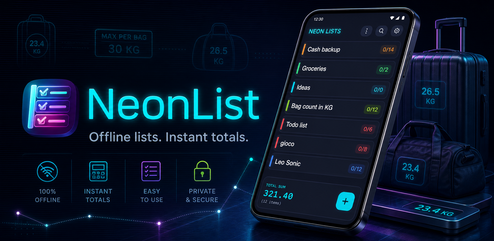
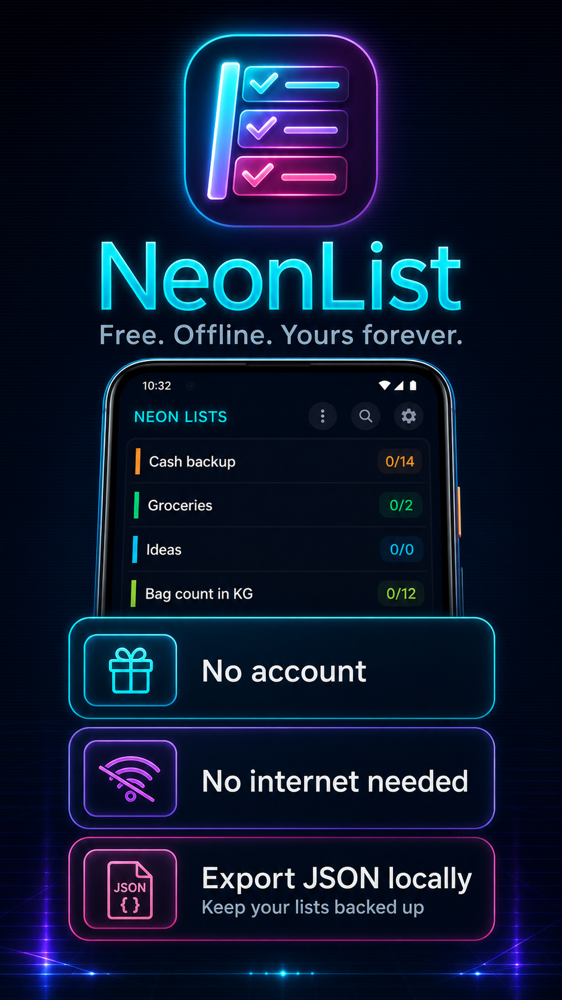
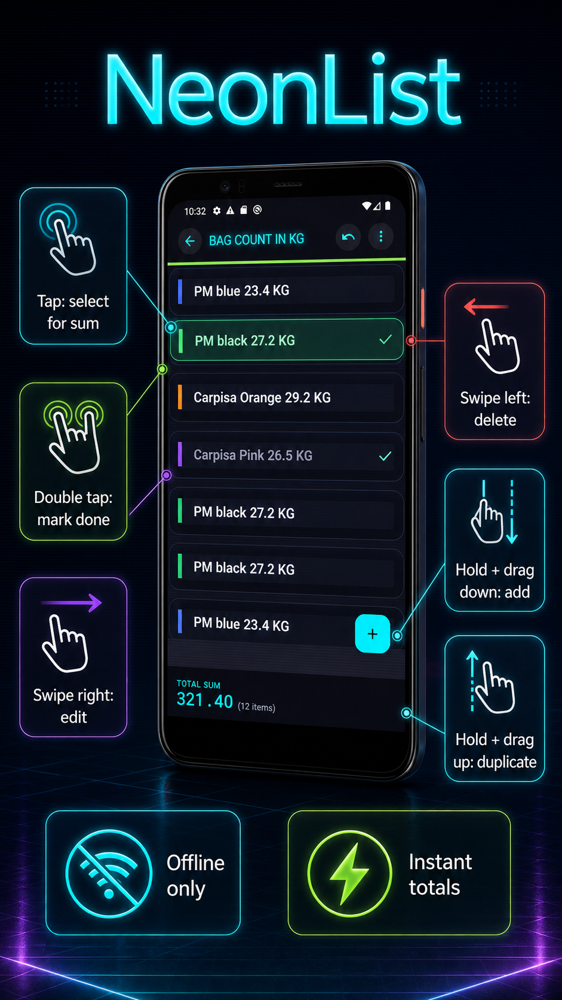

<div align="center">



# NeonList

**Free. Offline. Yours forever.**

NeonList is an offline Android list manager built for people who need fast lists, quick numeric totals, and confident local backup without accounts, ads, or cloud dependency.

[](https://www.android.com/)
[](https://kotlinlang.org/)
[](https://developer.android.com/jetpack/compose)
[](#privacy--data)
[](https://github.com/amilapcsgit/NeonList/releases/tag/v1.5)

**Package name:** `com.pcslanka.neonlist`  
**Status:** Release candidate prepared for Google Play publication

</div>

---

## Preview

<table>
  <tr>
    <td width="50%" align="center">
      
    </td>
    <td width="50%" align="center">
      
    </td>
  </tr>
</table>

---

## Why NeonList

NeonList is not just another to-do list. It is a small, fast, offline-first utility for managing lists where numbers matter.

Use it for shopping totals, cash tracking, packing, luggage balancing, quick inventory counts, ideas, tasks, or any list where you want the app to calculate totals while you type naturally.

Example:

```text
PM blue bag 23.4 KG
PM black bag 27.2 KG
Carpisa orange 29.2 KG
```

NeonList extracts the final number in each item and shows the total instantly. Tap selected items to calculate only those rows.

---

## Core Features

- **100% offline:** no account, no internet requirement, no cloud lock-in.
- **Instant numeric totals:** type natural list items with numbers and get live totals.
- **Selected sums:** tap specific rows to calculate only selected items.
- **Gesture workflow:** edit, delete, add, duplicate, and complete items quickly.
- **Local JSON backup:** export your lists to a JSON file using Android's system file picker.
- **Import JSON:** restore or merge saved local backups.
- **Manual ordering:** reorder lists and items when the exact sequence matters.
- **Search:** find lists and items quickly.
- **Multilingual UI:** English, Italian, and Sinhala.
- **Dark and light neon themes:** polished Material 3 + Jetpack Compose UI.

---

## Gesture Guide

| Gesture | Action |
| --- | --- |
| Tap item | Select for selected sum |
| Double tap item | Mark done |
| Swipe right | Edit list or item |
| Swipe left | Delete list or item |
| Hold + drag down | Add near the row |
| Hold + drag up | Duplicate list or item |
| Manual order mode | Drag handles to reorder |

Normal vertical drag still scrolls. Add and duplicate require **hold + drag**.

---

## Privacy & Data

NeonList is designed to keep your data on your device.

- No login.
- No account.
- No internet permission.
- No contacts, location, camera, microphone, or storage permission.
- App data is stored locally with Room/SQLite.
- Export uses Android's system document picker and writes only to the location you choose.
- Backup files are plain JSON so you can keep your own copies.

---

## Download

NeonList is being prepared for Google Play. Until the Play Store listing is live, release builds are available from GitHub.

- **Latest APK:** [NeonList-1.5.apk](https://github.com/amilapcsgit/NeonList/releases/download/v1.5/NeonList-1.5.apk)
- **Latest AAB:** [NeonList-1.5.aab](https://github.com/amilapcsgit/NeonList/releases/download/v1.5/NeonList-1.5.aab)
- **Release notes:** [releases/NeonList-1.5.md](releases/NeonList-1.5.md)
- **All releases:** [github.com/amilapcsgit/NeonList/releases](https://github.com/amilapcsgit/NeonList/releases)

> Note: APK sideloading may require allowing installs from your browser or file manager. Google Play distribution is the intended public release path.

---

## Build From Source

### Requirements

- Android Studio
- JDK 17
- Android SDK 35
- Android 10+ target device or emulator

### Commands

```powershell
git clone https://github.com/amilapcsgit/NeonList.git
cd NeonList/android

.\gradlew.bat :app:assembleDebug
.\gradlew.bat :app:testDebugUnitTest
```

Release builds require the signing keystore values to be supplied through local properties or environment variables. Signing secrets are not stored in this repository.

---

## Technical Stack

- **Language:** Kotlin
- **UI:** Jetpack Compose + Material 3
- **Architecture:** MVVM with StateFlow
- **Database:** Room / SQLite
- **Serialization:** Kotlinx Serialization
- **Minimum Android:** Android 10, API 29
- **Current app ID:** `com.pcslanka.neonlist`
- **Internal Kotlin namespace:** `com.cyberlist.neonlist`

Keeping the internal namespace separate from the Play Store app ID avoids unnecessary source-package churn while publishing under the final package name.

---

## Project Structure

```text
android/
  app/src/main/java/com/cyberlist/neonlist/
    data/          Room entities, DAOs, repository, import/export
    ui/            Compose theme, localization, app navigation
    ui/screens/    Home, list detail, search, settings
    ui/components/ Reusable controls and gesture components

releases/          Versioned APK/AAB release artifacts and notes
screenshots/       App screenshots and Play Store preview assets
```

---

## Roadmap

- Publish NeonList on Google Play.
- Continue polishing onboarding and store screenshots.
- Add more explicit first-run hints for selected sums and hold-drag gestures.
- Keep the app offline-first and simple by default.

---

## License

This project uses a custom license. See [LICENSE](LICENSE) for the full terms.

---

## Author

Created by **L.J. Amila Prasad Perera**

- GitHub: [amilapcsgit](https://github.com/amilapcsgit)
- Website: [amilaprasad.it](https://amilaprasad.it)

<div align="center">

**NeonList**  
Offline lists. Instant totals. Local backup.

</div>
