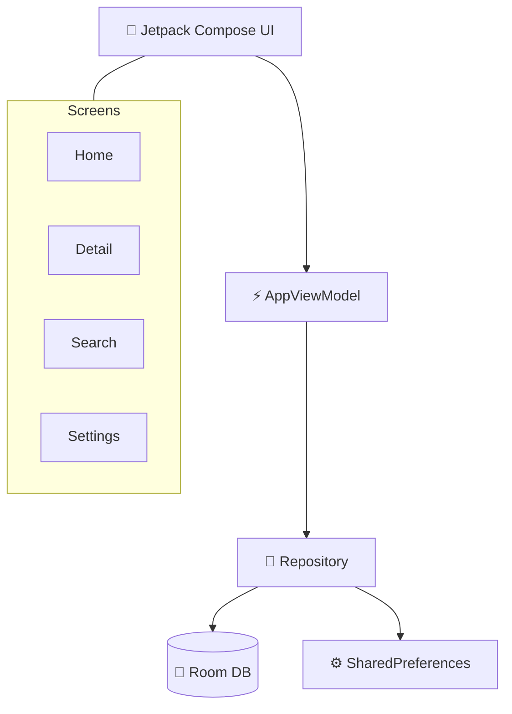

> [!IMPORTANT]
> **SYSTEM STATUS: ONLINE.** NeonList is a high-performance, multilingual list architect for Android 12+. Built for speed, efficiency, and aesthetics.

---

## 🌌 The Vision
NeonList isn't just a list manager; it's a statement. Designed with a **Cyberpunk UI**, it leverages **Material 3** and **Jetpack Compose** to deliver a fluid, haptic-rich experience.

- 💎 **Neon Aesthetics**: High-contrast, vibrant visuals that pop.
- 🌍 **Global Access**: Support for English, Italian, and Sinhala.
- 🛡️ **Zero Trace**: 100% offline-first storage with Room.
- ⚡ **Flow UX**: Gesture-driven interactions for power users.

---

## 📸 Visual Deck
<details>
<summary>📂 <b>CLICK TO EXPAND SCREENSHOTS</b></summary>

| Home Overview | Edit Action | Delete Action |
|:---:|:---:|:---:|
|  |  |  |

| Duplicate Action | List Detail | List Menu |
|:---:|:---:|:---:|
|  |  |  |

| Settings Screen |
|:---:|
|  |

</details>

---

## 🛠️ Technical Architecture

NeonList follows the modern **MVVM** pattern, ensuring a clean decoupling of logic and presentation.



> [!TIP]
> **Developer Insight:** For a deep dive into the code geometry, check out [ARCHITECTURE.md](file:///c:/Users/Amilapcs/source/repos/Tinylist-antigravity/tinylist/android/ARCHITECTURE.md).

---

## 🚀 Core Modules
- **Dynamic Flux**: Create, edit, and reorder lists with zero latency.
- **Neural Summation**: 
  - **Double-tap** to execute items.
  - **Auto-Scanner**: Extracts numeric values from item strings (e.g., "Credits 500") for real-time aggregation.
- **Cyber-Gestures**:
  - `SWIPE_LEFT` ➔ **PURGE**
  - `SWIPE_RIGHT` ➔ **REWRITE**
  - `SWIPE_UP` ➔ **CLONE**
  - `SWIPE_DOWN` ➔ **INITIATE**
- **Temporal Undo**: Multi-stack history rollback for all data mutations.
- **Vector Search**: Real-time cross-index matching.

---

## ⚙️ Deployment
### System Requirements
- **Core**: JDK 17
- **Terminal**: Android Studio Hedwig+
- **API Level**: 31 (Android 12) to 34+

### Build Protocol
```bash
./gradlew :app:assembleDebug
```

---

## 📝 Transmission Note
NeonList is optimized for real-world utility with a professional cyberpunk finish.
t storage, and a multilingual UI designed for real‑world use.
