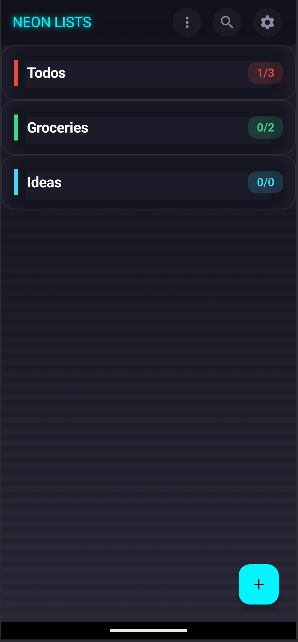
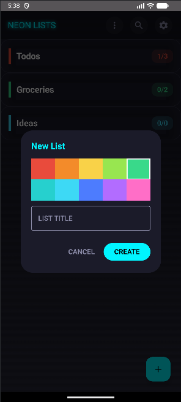
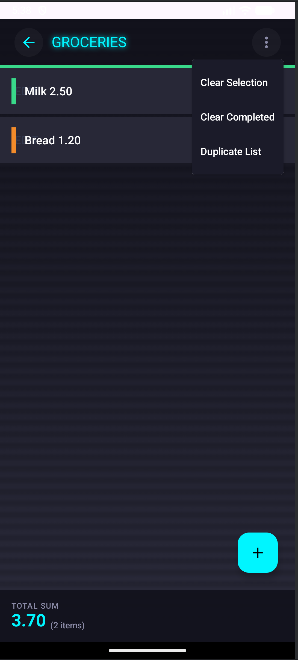

# TinyList (NeonList) - Android Revival

A modern Android (Jetpack Compose) recreation of an old Android 2.5-era list app, rebuilt with a cyber-neon UI, new gesture controls, offline-first storage, and safer data handling.

## What It Is
- Classic list manager feel, updated for Android 12+.
- Neon/cyberpunk interface inspired by the original tiny-list style.
- Offline-first: data stays on-device.
- Modern UX: swipe gestures, selection sum, quick search, export.

## Core Features
- Create, edit, delete lists and items
- Manual reorder of lists
- Swipe:
  - Right on item -> edit
  - Left on item -> delete
  - Double-tap item -> mark done
- Selection mode with numeric sum from item text
- Search across lists/items
- Export JSON backup

## Safety & Privacy
- No network calls: data is stored locally with Room.
- Exports are explicit and require user action (Storage Access Framework).
- No analytics or background uploads.

## Project Layout
- `android/` - Native Android app (Compose, Room)
- `source/` - Original web app source (preserved for reference)
- `docs/screenshots/` - App screenshots used in this README

## Screenshots




## Getting Started (Contributors)
1. Install JDK 17 and Android Studio.
2. Open the `android/` folder in Android Studio and let Gradle sync.
3. Run the `app` configuration on an Android 12+ emulator/device.
4. If you change UI code, run:
   ```bash
   ./gradlew :app:compileDebugKotlin
   ```
5. Keep UI updates consistent with the neon/tiny-list visual style.

## Build & Run
### Requirements
- JDK 17
- Android Studio (recommended)
- Android SDK (compileSdk 34, minSdk 31)

### Build (CLI)
From repo root:
```bash
cd android
./gradlew assembleDebug
```

### Run (Android Studio)
1. Open the `android/` folder in Android Studio.
2. Let Gradle sync.
3. Run the `app` configuration on a device or emulator (Android 12+).

## Notes
This project intentionally mirrors the visual and interaction model of an older Android 2.5 list app, but upgrades it with modern Compose UI, improved gesture controls, and safer local storage practices.
