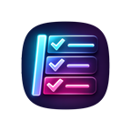
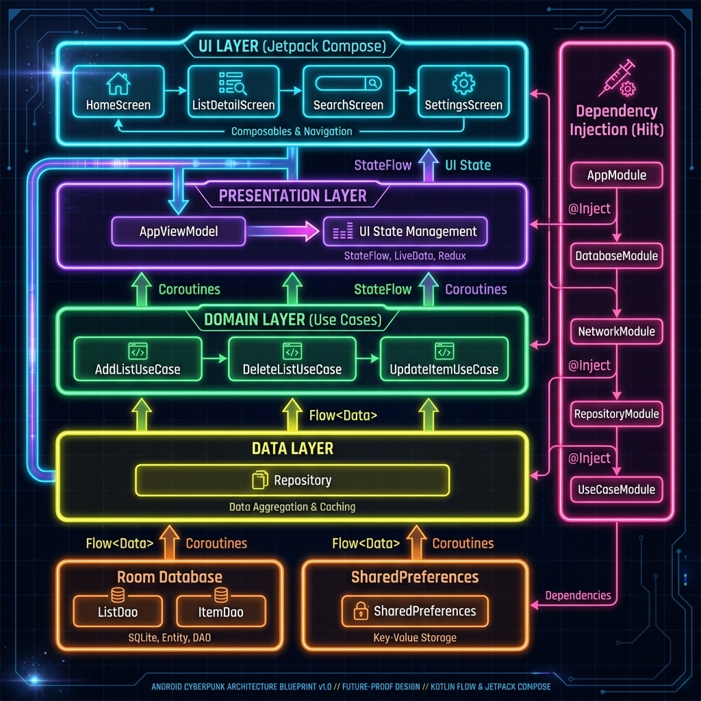
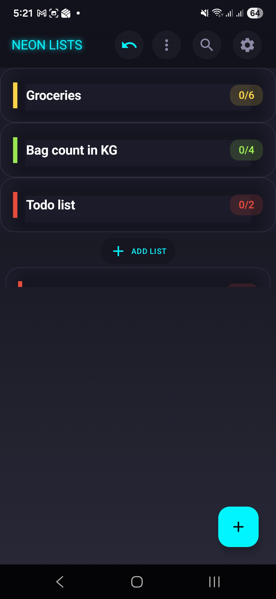
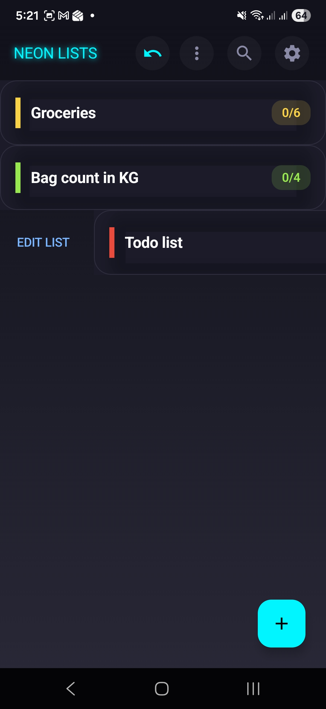
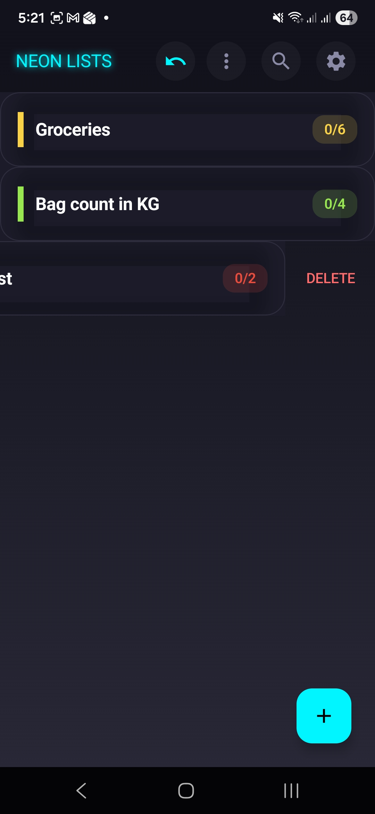
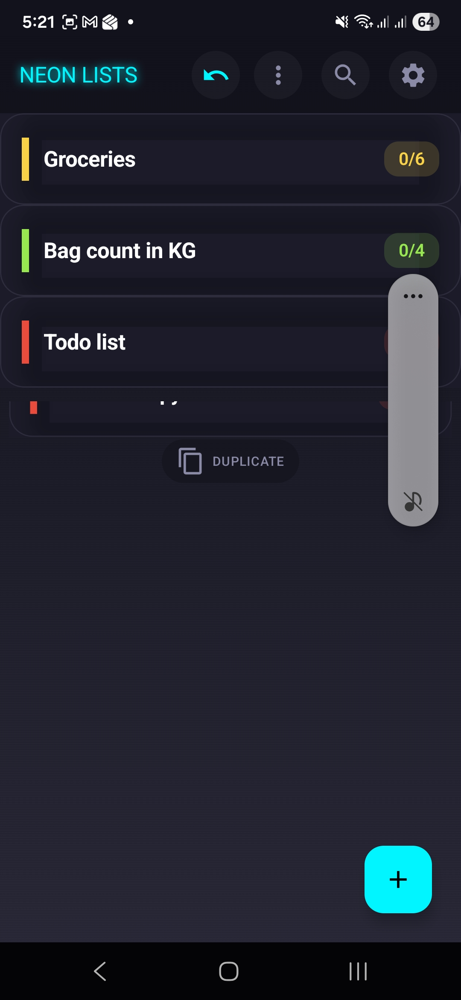
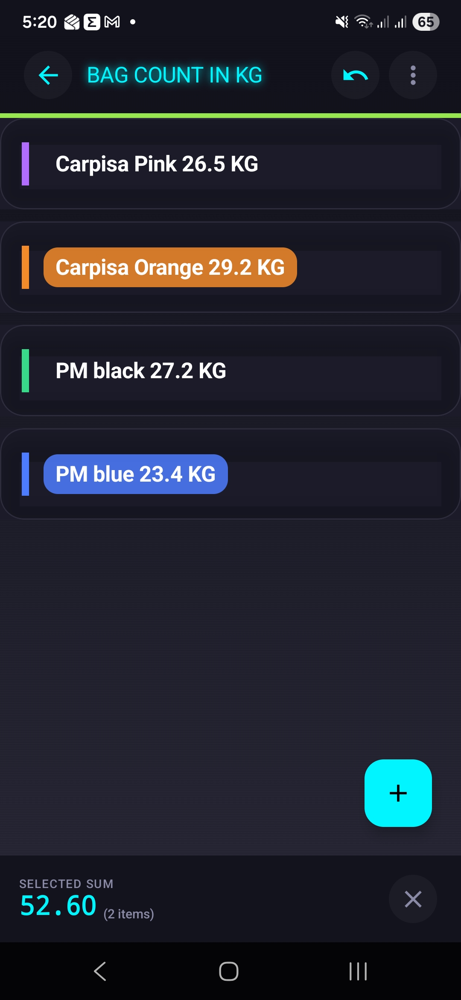
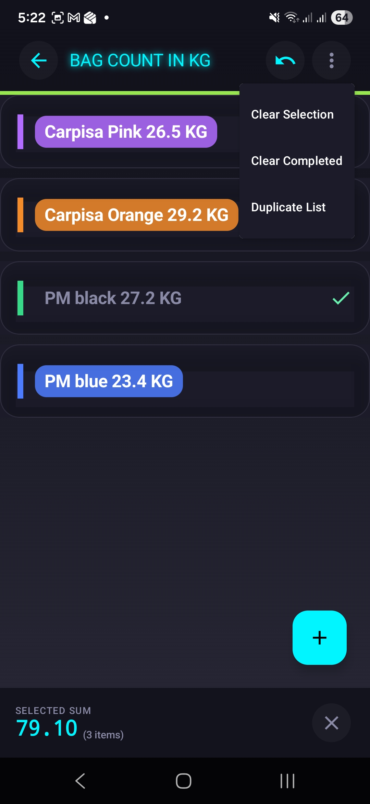
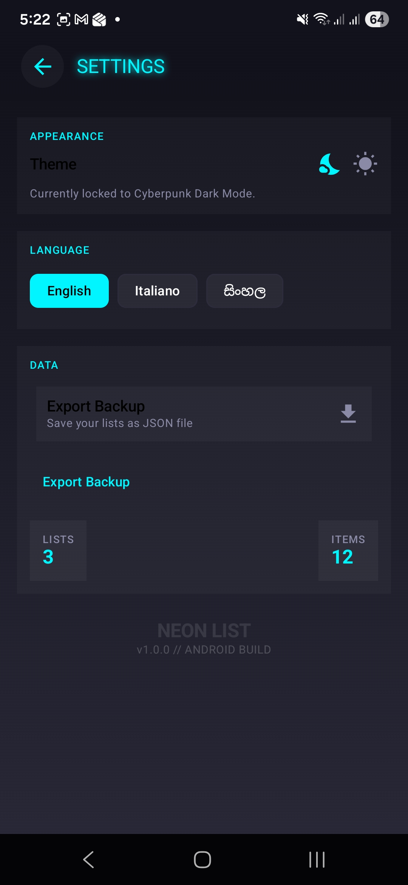

<div align="center">



# NeonList

**A high-performance, multilingual list manager with cyberpunk aesthetics**

[](https://www.android.com/)
[](https://kotlinlang.org/)
[](https://developer.android.com/jetpack/compose)
[](LICENSE)
[](https://github.com/amilapcsgit/tinylist/releases/download/v1.3/NeonList-1.3.apk)


---

### 📊 Architecture Overview



---

### 📑 Table of Contents

→ [Features](#-features)  
→ [Installation](#-installation)  
→ [Architecture](#%EF%B8%8F-architecture)  
→ [Usage](#-usage)  
→ [Contribution](#-contribution)  
→ [License](#-license)  
→ [Contact](#-contact)

---

[](https://github.com/amilapcsgit/tinylist)
[](https://twitter.com)
[](https://amilaprasad.it)

*© 2026 L.J. Amila Prasad Perera. All rights reserved. Built with passion.*

</div>

---

## ✨ Features

NeonList isn't just a list manager; it's a statement. Designed with a **Cyberpunk UI**, it leverages **Material 3** and **Jetpack Compose** to deliver a fluid, haptic-rich experience.

- 💎 **Neon Aesthetics**: High-contrast, vibrant visuals that pop
- 🌍 **Global Access**: Support for English, Italian, and Sinhala
- 🛡️ **Zero Trace**: 100% offline-first storage with Room
- ⚡ **Flow UX**: Gesture-driven interactions for power users
- 🎯 **Smart Summation**: Auto-extracts numeric values for real-time aggregation
- 🔄 **Temporal Undo**: Multi-stack history rollback for all data mutations

---

## 📥 Installation

### System Requirements
- **Platform**: Android 10+ (API Level 29+)
- **Development**: Android Studio Hedgehog+
- **Build**: JDK 17

### Build from Source

```bash
# Clone the repository
git clone https://github.com/amilapcsgit/tinylist.git

# Navigate to project directory
cd tinylist/android

# Build debug APK
./gradlew :app:assembleDebug

# Or build release APK
./gradlew :app:assembleRelease
```

### Download APK

Download the latest release from the [Releases](releases/) page.

- **Latest stable:** `NeonList-1.3.apk` (API 29+)
- **Release notes:** [`releases/NeonList-1.3.md`](releases/NeonList-1.3.md)

### Install APK (Unknown Sources)

If you install the APK directly (outside Play Store), Android may block it until you allow one-time install permission for the app you downloaded with (browser or file manager).

1. Tap the downloaded `NeonList-1.3.apk`.
2. If prompted, open **Settings** and enable **Allow from this source** for that installer app.
3. Go back and tap **Install**.
4. (Optional) Disable **Allow from this source** again after install.

### Why This Is Safe

- NeonList works offline and does not require account login.
- The app manifest does not request internet, contacts, location, camera, microphone, or storage permissions.
- Backup export uses Android's system file picker and writes only to the location you explicitly choose.
- Download from the official GitHub release asset to avoid tampered APK files.

---

## 🏗️ Architecture

NeonList follows the modern **MVVM** pattern with clean architecture principles:

```
┌─────────────────────────────────────┐
│         UI Layer (Compose)          │
│  HomeScreen │ DetailScreen │ etc.   │
└──────────────┬──────────────────────┘
               │
┌──────────────▼──────────────────────┐
│      Presentation Layer (VM)        │
│         AppViewModel                │
└──────────────┬──────────────────────┘
               │
┌──────────────▼──────────────────────┐
│        Data Layer (Repo)            │
│          Repository                 │
└──────┬──────────────────┬───────────┘
       │                  │
┌──────▼──────┐    ┌─────▼──────────┐
│  Room DB    │    │ SharedPrefs    │
│  (SQLite)   │    │ (Settings)     │
└─────────────┘    └────────────────┘
```

**Key Components:**
- 🎨 **UI Layer**: Jetpack Compose screens with Material 3
- 🎭 **Presentation Layer**: ViewModels with StateFlow
- 💾 **Data Layer**: Repository pattern with Room + SharedPreferences

> [!TIP]
> For detailed architecture documentation, see [ARCHITECTURE.md](android/ARCHITECTURE.md)

---

## 🚀 Usage

### Core Gestures

NeonList uses intuitive **cyber-gestures** for power users:

| Gesture | Action | Description |
|---------|--------|-------------|
| `SWIPE_LEFT` | **PURGE** | Delete item/list |
| `SWIPE_RIGHT` | **REWRITE** | Edit item/list |
| `HOLD_DRAG_UP` | **CLONE** | Duplicate item/list |
| `HOLD_DRAG_DOWN` | **INITIATE** | Create new item/list |
| `DOUBLE_TAP` | **EXECUTE** | Mark item as complete |

### Smart Features

- **Neural Summation**: Automatically extracts numeric values from items (e.g., "Coffee $4.50") and calculates totals
- **Temporal Undo**: Undo up to 10 recent actions with smart history tracking
- **Vector Search**: Real-time search across all lists and items
- **Dynamic Reordering**: Drag and drop to reorganize lists and items

---

## 📸 Screenshots

<details>
<summary>📂 <b>CLICK TO EXPAND SCREENSHOTS</b></summary>

| Home Overview | Edit Action | Delete Action |
|:---:|:---:|:---:|
|  |  |  |

| Duplicate Action | List Detail | List Menu |
|:---:|:---:|:---:|
|  |  |  |

| Settings Screen |
|:---:|
|  |

</details>

---

## 📚 Documentation

Comprehensive code analysis and improvement guides are available:

| Document | Description | Read Time |
|----------|-------------|-----------|
| [📋 START_HERE.md](START_HERE.md) | Navigation guide for all documents | 5 min |
| [📊 README_ANALYSIS.md](README_ANALYSIS.md) | Executive summary & findings | 10 min |
| [⚡ QUICK_IMPROVEMENTS.md](QUICK_IMPROVEMENTS.md) | Fast-track improvement guide | 15 min |
| [📖 CODE_ANALYSIS_REPORT.md](CODE_ANALYSIS_REPORT.md) | Complete technical analysis (50+ pages) | 60 min |
| [✅ IMPROVEMENT_CHECKLIST.md](IMPROVEMENT_CHECKLIST.md) | Progress tracking checklist | 5 min |

**Analysis Highlights:**
- 🎯 **Code Quality:** 4/5 stars (can reach 5/5 with improvements)
- 📊 **45 Recommendations** across architecture, testing, security, and performance
- 🚀 **Expected Gains:** +40% maintainability, +60% test coverage, -30% APK size

---

## 🤝 Contribution

We welcome contributions! Here's how you can help:

1. **Fork the Repository** - Create your own fork
2. **Create a Branch** - `git checkout -b feature/amazing-feature`
3. **Commit Changes** - `git commit -m 'Add amazing feature'`
4. **Push to Branch** - `git push origin feature/amazing-feature`
5. **Open Pull Request** - Submit your PR for review

### Contribution Guidelines

- Follow Kotlin coding conventions
- Write meaningful commit messages
- Add tests for new features
- Update documentation as needed

Before contributing, please review:
- [CODE_ANALYSIS_REPORT.md](CODE_ANALYSIS_REPORT.md) for architecture guidelines
- [IMPROVEMENT_CHECKLIST.md](IMPROVEMENT_CHECKLIST.md) for current priorities

---

## 📄 License

This software is protected by a **Custom License**. It is **Free for Personal Use** but restricted for commercial distribution. See the [LICENSE](LICENSE) file for details.

```text
Copyright (c) 2026 L.J. Amila Prasad Perera

1. NON-COMMERCIAL USE ONLY
2. NO REDISTRIBUTION
3. ATTRIBUTION REQUIRED
4. NO WARRANTY
```

---

## 🙏 Acknowledgments

Special thanks to:

- **Jetpack Compose Team** - For the amazing UI toolkit
- **Material Design** - For the design system
- **Android Community** - For continuous support and inspiration
- **Contributors** - Everyone who has contributed to this project

**Technologies Used:**
- [Kotlin](https://kotlinlang.org/) - Programming language
- [Jetpack Compose](https://developer.android.com/jetpack/compose) - UI framework
- [Room](https://developer.android.com/training/data-storage/room) - Database
- [Coroutines](https://kotlinlang.org/docs/coroutines-overview.html) - Async programming
- [Material 3](https://m3.material.io/) - Design system

---

## 📞 Contact

- 📧 **Email**: [amilapcsgit@gmail.com](mailto:amilapcsgit@gmail.com)
- 💬 **Issues**: [GitHub Issues](https://github.com/amilapcsgit/tinylist/issues)
- 🌐 **Website**: [amilaprasad.it](https://amilaprasad.it)

---

<div align="center">

### ⚡ Built with Passion ⚡

**NeonList** - *Optimized for real-world utility with a professional cyberpunk finish*

Made with 💜 by **L.J. Amila Prasad Perera** | Powered by Kotlin & Jetpack Compose

---


**Star ⭐ this repository if you find it useful!**

</div>
